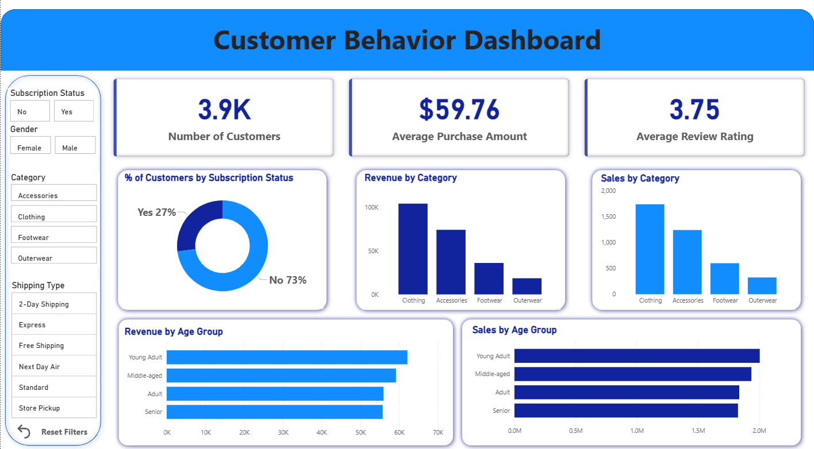

# 🛍️ Customer Behavior Analysis


---

# 📌 Project Overview

This is an end-to-end **Data Analytics** project that analyzes customer shopping behavior using **Python, PostgreSQL, SQL, and Power BI**.

The project follows the complete data analytics lifecycle, including:

- Data Cleaning
- Exploratory Data Analysis (EDA)
- Feature Engineering
- Database Integration
- SQL Business Analysis
- Interactive Dashboard Development

The objective is to identify customer purchasing patterns, product preferences, revenue trends, and customer segments to support data-driven business decisions.

---

# 📂 Dataset

- **Dataset:** Customer Shopping Trends Dataset
- **Source:** Kaggle
- **Records:** 3,900
- **Features:** 18

### Dataset Features

- Customer ID
- Age
- Gender
- Category
- Item Purchased
- Purchase Amount
- Subscription Status
- Shipping Type
- Discount Applied
- Promo Code Used
- Previous Purchases
- Payment Method
- Frequency of Purchases
- Review Rating
- Season
- Color
- Size
- Location

---

# 🛠️ Tools & Technologies

| Tool | Purpose |
|------|----------|
| Python | Data Cleaning & Analysis |
| Pandas | Data Manipulation |
| NumPy | Numerical Operations |
| PostgreSQL | Database Management |
| SQL | Business Analysis |
| SQLAlchemy | Database Connection |
| Power BI | Dashboard & Visualization |
| Jupyter Notebook | Development Environment |
| Git & GitHub | Version Control |

---

# 📊 Project Workflow

## 1️⃣ Data Loading

- Loaded CSV dataset into Python
- Explored dataset structure
- Checked data types
- Identified missing values

---

## 2️⃣ Exploratory Data Analysis (EDA)

Performed:

- Dataset overview
- Summary statistics
- Missing value analysis
- Duplicate detection
- Category distribution
- Numerical feature analysis
- Outlier detection
- Correlation analysis

---

## 3️⃣ Data Cleaning & Feature Engineering

Performed the following preprocessing steps:

- Removed duplicate records
- Renamed column names to snake_case
- Handled missing values
- Imputed missing Review Rating values using the median of each product category
- Created **Age Group**
- Created **Purchase Frequency (Days)**
- Converted data types where required

---

## 4️⃣ Database Integration

- Connected Python with PostgreSQL using SQLAlchemy
- Created PostgreSQL database
- Imported cleaned dataset into PostgreSQL
- Verified successful data loading

---

# 📈 SQL Business Analysis

The following business questions were answered using SQL:

- Total revenue by gender
- Revenue by product category
- Revenue by age group
- Sales by category
- Top-rated products
- Customer segmentation
- Subscriber vs Non-Subscriber analysis
- Shipping type analysis
- Discount impact analysis
- Repeat customer analysis

---

# 📊 Power BI Dashboard

Designed an interactive Power BI dashboard to visualize customer purchasing behavior.

### KPI Cards

- Total Customers
- Average Purchase Amount
- Average Review Rating

### Visualizations

- Revenue by Category
- Sales by Category
- Revenue by Age Group
- Sales by Age Group
- Subscription Status Distribution

### Interactive Filters

- Subscription Status
- Gender
- Category
- Shipping Type
- Reset Filters Button

---

# 📷 Dashboard Preview



---

# 📌 Business Questions Answered

- Which product category generates the highest revenue?
- Which customer age group contributes the highest sales?
- How does subscription status affect customer purchases?
- Which shipping method is used the most?
- Which product categories perform best?
- What is the average customer purchase amount?
- What is the average review rating?

---

# 💡 Key Insights

- Clothing generated the highest overall revenue.
- Young Adult customers contributed the highest sales.
- Approximately **27%** of customers were subscribers.
- Nearly **73%** of customers were non-subscribers.
- The average purchase amount was **$59.76**.
- The average customer review rating was **3.75**.

---

# 🎯 Skills Demonstrated

- Data Cleaning
- Exploratory Data Analysis (EDA)
- Feature Engineering
- PostgreSQL
- SQL Queries
- Data Visualization
- Dashboard Design
- Business Intelligence
- Business Insight Generation
- Git & GitHub

---

# 📁 Project Structure

```text
customer-behavior-analysis/
│
├── data/
│   └── customer_shopping_behavior.csv
│
├── notebooks/
│   └── Customer_Shopping_Behavior_Analysis.ipynb
│
├── sql/
│   └── customer_behavior_sql_queries.sql
│
├── dashboard/
│   ├── Customer_Behavior_Dashboard.pbix
│   └── dashboard.png
│
├── report/
│   └── Customer_Shopping_Behavior_Analysis.pdf
│    └── Customer_Shopping_Behavior_Analysis.pptx
├── README.md
│
└── LICENSE
```

---

# ▶️ How to Run

## Clone the Repository

```bash
git clone https://github.com/ashnak7994/customer-behavior-analysis.git
```

## Open the Project

1. Open the Jupyter Notebook from the **notebooks** folder.
2. Run all notebook cells to clean and analyze the dataset.
3. Create a PostgreSQL database.
4. Import the cleaned dataset into PostgreSQL.
5. Execute the SQL queries available in the **sql** folder.
6. Open the **Customer_Behavior_Dashboard.pbix** file using Power BI Desktop to explore the interactive dashboard.

---

# 📄 Project Report

A detailed project report explaining the methodology, SQL analysis, dashboard creation, business insights, and recommendations is available in the **report** folder.

---

# 🚀 Future Improvements

- Build a Machine Learning model to predict customer purchase behavior.
- Perform customer segmentation using clustering algorithms.
- Publish the Power BI dashboard online.
- Automate the ETL pipeline.
- Build a real-time analytics dashboard.

---

# 👩‍💻 Author

**Ashna K**

📧 Data Science & AI Engineer

- **GitHub:** https://github.com/ashnak7994
- **LinkedIn:** https://www.linkedin.com/in/ashnakottakkal/

---

## ⭐ If you found this project helpful, consider giving it a Star!
